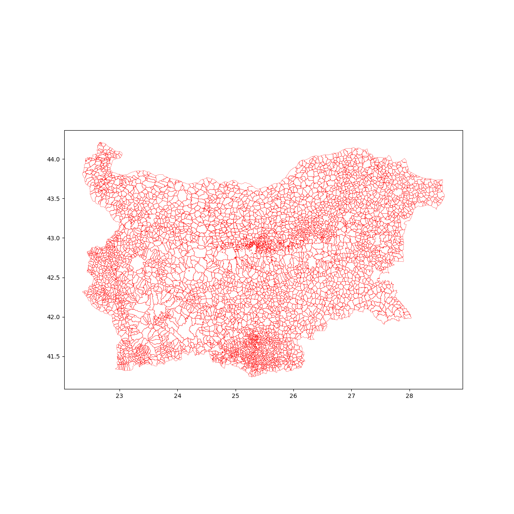

# bg-ekatte-lib

## Context

## Data Sources

- official ekatte source -> https://www.nsi.bg/nrnm/ekatte/index
- ekatte geospatial sources:
  - mapslabio data source -> 
  - openstreetmap data source -> 
  - zemcad data sources -> 
  - github repo -> https://github.com/justinelliotmeyers/BULGARIA_2018_EKATTE

- misk data sources:
  - parcels Bulgaria 2015 -> https://revolutionarygis.wordpress.com/2015/08/11/bulgaria-parcel-shapefile-data/

## Run and Testing

## Misk

Source BG Geo

WGS BG GeoObjects

BG Ekatte Extent Map

